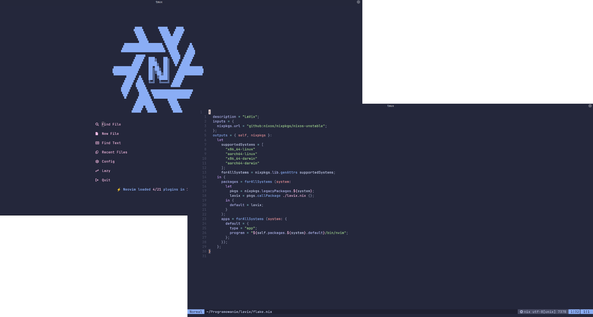

# lavix

**lavix** is a reproducible Neovim configuration that integrates [Nix flakes](https://nixos.wiki/wiki/Flakes) with [lazy.nvim](https://github.com/folke/lazy.nvim), enabling declarative plugin management and a streamlined development environment.

<p align="center">
  
</p>

## Features

- **Nix Flakes**: Manage Neovim and its plugins declaratively using Nix flakes.
- **lazy.nvim**: Efficiently handle plugin loading and configuration within Neovim.
- **Lua Configuration**: Customize Neovim behavior through Lua scripts.

## Getting Started

To try out this configuration, simply run:

```bash
nix run github:WJKPK/lavix
```

This command builds the Neovim environment defined by the flake and launches Neovim with the configured settings.
## Notes

- **Read-Only Configuration**: All configuration files and plugins are stored in the `/nix/store`. Reconstruction times are short, so I decided to be fully declarative.

## Prerequisites

- [Nix](https://nixos.org/download.html) with flakes enabled.

## License

This project is licensed under the MIT License.
